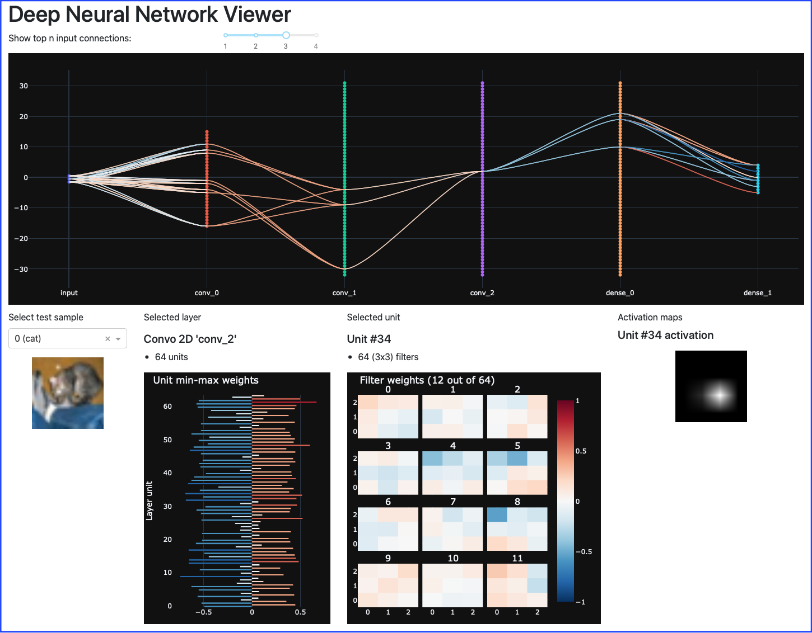

# Deep Neural Network viewer

A dashboard to inspect deep neural network models, providing interactive view on the layer and unit weights and gradients, as well as activation maps.

This project is for learning and teaching purpose, do not try to display a network with hundreds of layers.



# Install

1. Clone the repository `git clone https://github.com/tonio73/dnnviewer.git` on your local machine
2. Using Conda or Pip, install the dependencies within your environment following the file [`environment.yml`](enviroment.yml)
3. Run `dnnviewer.py` with one of the examples below, or with you own model (see below for capabilities and limitations)
4. Access the web application at http://127.0.0.1:8050

# Running the program

#### CIFAR-10 Convolutionnal neural network

Using test data provided by Keras

```
$ ./dnnviewer.py --model-keras stimuli/models/CIFAR-10_CNN5.h5 --test-dataset cifar-10
```

#### MNIST Convolutionnal neural network based on LeNet5

Using test data provided by Keras

```
$ ./dnnviewer.py --model-keras stimuli/models/MNIST_LeNet60.h5 --test-dataset mnist
```

#### MNIST Dense only neural network

Using test data provided by Keras

```
$ ./dnnviewer.py --model-keras stimuli/models/MNIST_dense128.h5 --test-dataset mnist
```

# Current capabilities

- Load **Tensorflow Keras Sequential** models and create a display of the network
- Interactive display and unit weights through connections within the network and histograms
- Supported layers
  - Dense
  - Convolution 2D
  - Flatten
  - Input
- Ignored layers (no impact on the representation)
  - Dropout, ActivityRegularization, SpatialDropout1D/2D/3D
  - All pooling layers
  - BatchNormalization
  - Activation
- Unsupported layers
  - Reshape, Permute, RepeatVector, Lambda, ActivityRegularization, Masking
  - Recurrent layers (LSTM, GRU...)
  - Embedding layers
  - Merge layers

# Software architecture

The application is based on Dash for the user interface management (which is generating ReactJs components), and Plotly for the data visualization.

Code is separated in two branches:

- The Graphical representation
- Adapters to read existing models, currently only supporting Keras

### Code quality

- Code is PEP8 compliant, thanks to Intellij for watching
- There are a few pytest unit tests in `unittests/`